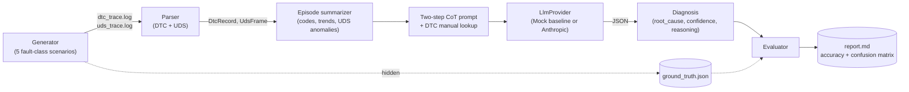

# DTC Log Intelligence

A synthetic-data pipeline that generates realistic automotive DTC/UDS fault
logs, parses them back into structured records, and runs an LLM diagnosis
layer over them that has to pick a probable root cause from a closed set of
fault classes graded automatically against the generator's own ground
truth. No real vehicle or client data anywhere in this repo; that's not a
compliance workaround, it's the actual design, because synthetic-with-known-
labels is the only way to *measure* whether the LLM layer is adding value
over a naive lookup, rather than just asserting that it does.

## Problem

"AI-augmented diagnostics" is easy to claim and hard to demonstrate honestly.
Real fault logs don't come with ground truth attached a real technician's
eventual repair is the closest thing to a label, and it's noisy, delayed, and
not something you can put in a portfolio repo without a client's data. So
most demo projects in this space either fabricate a compelling-sounding
accuracy number or quietly skip evaluation altogether.

This repo takes the other option: build the fault scenarios yourself, so you
know exactly what's true, and can prove not assert where a reasoning
layer earns its keep over a simple lookup table, and where it doesn't.

## Architecture



One session's path: the generator picks a fault class and writes out raw
text traces the way a diagnostic tool actually would, tagging the true class
only in a side file the rest of the pipeline never reads. The parser turns
those raw lines into typed records, tolerating malformed lines instead of
aborting. The episode summarizer condenses possibly dozens of lines into the
handful of facts that matter which codes appeared, whether their status
went pending → confirmed, whether a sensor trend is a clean ramp or noisy,
whether the UDS bus behaved. That summary becomes a two-step chain-of-thought
prompt grounded in a small DTC manual, sent to whichever provider is
configured, and the JSON response is graded against the one thing a real
deployment would never have: the actual answer.

## Decisions and trade-offs

**The fault taxonomy is a closed set of five classes, not open-ended.**
`healthy`, `misfire_cascade`, `cooling_failure`, `network_dropout`,
`sensor_drift`. A real diagnostic assistant would need many more, but a
closed set is what makes automated grading possible at all the LLM is told
exactly which labels are acceptable, and the eval harness does an exact
string comparison instead of trying to fuzzy-match free text against free
text. That's a real scope limitation, and the honest reason to keep it: this
repo is built to measure something precisely, not to be a complete
diagnostic system.

**One fault class is deliberately ambiguous by design.** `sensor_drift` has
three variants; one of them (a drifting coolant-temperature sensor) emits the
*exact same DTC code* (`P0128`) that `cooling_failure` emits, and the reading
climbs in both cases too. The only way to tell them apart is the shape of the
trend (a real thermal failure is a clean, strictly-increasing ramp; a bad
sensor is noisy and doesn't correlate with engine load or RPM the way real
heat would) a detail a code-only lookup structurally cannot see, no matter
how big its lookup table gets. This isn't an edge case that slipped in by
accident; it's the one fault class that exists specifically to give a
context-aware reasoner something to be right about that a naive baseline
can't be.

**`MockLlmProvider` is a real baseline, not a placeholder.** It's a fixed
code→fault-class lookup table with zero awareness of trends, status
progression, or UDS context. Running the full pipeline against it (no API
key required) produces an actual, measured number: **97.5% overall, but only
83.3% on `sensor_drift`** specifically because of the ambiguous P0128 case
(`data/run1/report.md`, seed 7, 80 sessions see the Results section below).
That's the honest floor a real LLM has to beat, in the one place it's
supposed to matter, to justify the extra latency and cost of calling one.
I have not run this against the real Anthropic API in the environment this
repo was built in, so there's no fabricated "LLM gets 100%" number here
set `LLM_PROVIDER=anthropic` and an API key and that comparison is one
command away (`python -m dtc_log_intelligence.cli run --provider anthropic`).

**Traces are realistic-looking text, not pre-structured CSV.** Each line is
`[timestamp] KEY=VALUE ...`, which is enough to require a real tokenizer and
real handling of optional fields (freeze-frame data is entirely absent
during a network dropout, which is itself diagnostic signal) a
demonstration of parsing skill a pre-cleaned CSV wouldn't need. The UDS trace
format tracks three response shapes from ISO 14229 (positive response,
negative response with an NRC, and this generator's synthetic stand-in for
"no response at all": `TIMEOUT=1`, normalized to `nrc="timeout"` so
downstream code has one field to check instead of a special case for
silence).

**The DTC manual is hand-curated, not scraped.** Ten generic (SAE J2012)
code definitions, written from public, generic knowledge of what those codes
mean — not a transcription of any real OEM service manual. That sidesteps
any IP question, and it also means the manual and the generator agree by
construction: every code the generator can emit has an entry, and every
entry describes a real generic definition.

**An unparseable LLM response is graded as wrong, not excluded.** Some
responses won't come back as clean JSON — wrapped in markdown fences, padded
with prose, occasionally just malformed. `_extract_json` tries to recover the
first `{...}` block and gives up cleanly if it can't; `diagnose_session`
tags that result `parse_ok=False` and a `root_cause` of `"unparseable"`
rather than silently dropping the session, and the evaluator counts it
against accuracy rather than shrinking the denominator. Quietly excluding
failed-to-parse cases is exactly how an eval ends up flattering a provider
that can't reliably follow a JSON contract.

**This doesn't share a provider abstraction with Repo 1.** The gateway repo
has its own `ILlmProvider`; this repo has its own `LlmProvider` Protocol in
Python. Same shape, same idea, deliberately not extracted into a shared
package these are meant to be read independently, and a shared dependency
would mean an interviewer cloning this repo alone also needs the other one.

## Results (this repo's own bundled run)

`data/run1/` in this repo is a real run, not a mocked-up example generated
and graded in the environment this repo was built in, 80 sessions, seed 7,
`LLM_PROVIDER=mock`:

| Fault class | Sessions | Accuracy |
|---|---|---|
| cooling_failure | 20 | 100.0% |
| healthy | 18 | 100.0% |
| misfire_cascade | 15 | 100.0% |
| network_dropout | 15 | 100.0% |
| sensor_drift | 12 | 83.3% |
| **Overall** | **80** | **97.5%** |

The two misses are both the ambiguous coolant-sensor-drift variant, both
mislabeled as `cooling_failure` exactly the failure mode the fault class
was built to expose. See `data/run1/report.md` for the full confusion matrix
and the missed sessions' reasoning text.

## Failure modes

| Situation | What happens |
|---|---|
| LLM response isn't valid JSON | `_extract_json` tries to recover a `{...}` block from markdown fences or surrounding prose; if that fails, the diagnosis is tagged `unparseable` and scored as wrong |
| LLM picks a label outside the closed set | Coerced to `"other"` rather than crashing the eval a real but rare failure mode worth tracking, not hiding |
| A DTC code isn't in the manual | The prompt says so explicitly (`"not in the manual (unrecognized code)"`) instead of silently omitting it the model should know its grounding is incomplete, not be given a gap it can't see |
| A log line is malformed | Parser logs a warning with line number and file, skips that line, keeps going one bad line doesn't lose the rest of the session |
| Freeze-frame telemetry entirely absent (comms loss) | `FreezeFrame` tolerates all-`None` fields; the prompt calls out the absence itself as signal rather than presenting empty fields silently |
| No `ANTHROPIC_API_KEY` set with `--provider anthropic` | Fails fast at provider construction with a clear error, before any sessions are generated or diagnosed |

## What I'd do differently

Replace the hand-tuned parameter ranges in `generator/faults.py` with an
actual learned distribution (closer to the CTGAN approach in the Mahale et
al. paper) once there's a real seed dataset to fit against hand-tuned
ranges are a reasonable stand-in with zero real data available, not a
long-term plan. Add a second ambiguous fault-class pair beyond the P0128
overlap, since one designed hard case makes a good demonstration but a real
eval suite would want several. Add a proper LLM-as-judge pass over the
*reasoning* text, not just the final label two diagnoses can pick the
right root cause for different (one sound, one lucky) reasons, and the
current eval can't tell those apart. And run the real Anthropic comparison
this README currently only gestures at, once that's something worth spending
API credits on rather than something claimed without having done it.

## Running it

```bash
pip install -r requirements.txt

# Regenerate the bundled example (deterministic: same output every time)
python -m dtc_log_intelligence.cli run --sessions 80 --seed 7 --provider mock --out-dir data/run1

# Or point it at the real Anthropic API
export ANTHROPIC_API_KEY=sk-...
python -m dtc_log_intelligence.cli run --sessions 80 --seed 7 --provider anthropic --out-dir data/run_anthropic
```

Each run writes, under `--out-dir`: one `session_NNN/{dtc_trace.log,
uds_trace.log}` per session, `ground_truth.json` (the labels, kept separate
from everything the diagnosis layer sees), `diagnoses.json` (every raw model
response plus the parsed verdict), and `report.md` (the table above, plus a
full confusion matrix and the reasoning text for every miss).

## Testing

```bash
pytest tests/ -v
```

26 tests, all passing in this repo's own environment: generator determinism
and coverage of all five fault classes, parser correctness including
malformed-line handling, tolerant JSON extraction (clean, fenced, prose-
wrapped, and invalid), the mock provider's behavior including its documented
P0128 blind spot, and the evaluation scoring logic including a real bug
that test suite caught during development (`per_class_accuracy` raised
`KeyError` for any class with zero correct predictions, because a
`defaultdict` converted to a plain `dict` silently drops never-incremented
keys; fixed with `.get(cls, 0)`).

## Layout

```
dtc_log_intelligence/
  domain.py              FaultClass, DtcRecord, UdsFrame, SessionLog
  generator/
    faults.py               one generation function per fault class
    synth.py                orchestrates a run, writes traces + ground_truth.json
  parser/
    common.py                shared [timestamp] KEY=VALUE tokenizer
    dtc_parser.py, uds_parser.py
  knowledge/
    dtc_manual.json           hand-curated generic DTC definitions
  diagnosis/
    episodes.py               condenses parsed records into a summary
    prompts.py                two-step CoT prompt, closed label set
    providers.py               MockLlmProvider (baseline) + AnthropicLlmProvider
    diagnose.py                orchestrates summary -> prompt -> provider -> Diagnosis
  evaluation/
    scoring.py                 grades against ground truth, confusion matrix
  report.py                 renders report.md
  cli.py                    generate -> parse -> diagnose -> evaluate -> report
tests/                     26 tests across every module above
data/run1/                 a real bundled example run (seed 7, mock provider)
```
